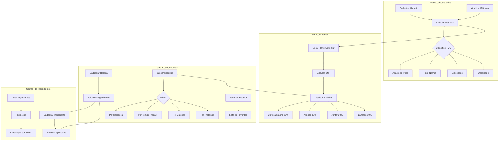

# ChefIT API 👨‍🍳

## Sobre o Projeto

O ChefIT é uma API RESTful inovadora que combina tecnologia e nutrição, oferecendo um sistema completo de gestão de receitas e planejamento alimentar personalizado. Desenvolvido para auxiliar tanto usuários individuais quanto profissionais da área de nutrição, o sistema calcula métricas individuais e recomenda receitas baseadas no perfil nutricional de cada usuário.

## 📊 Visão Geral do Sistema



## 🚀 Funcionalidades Principais

### 👤 Gestão de Usuários
- Cadastro de perfil com dados antropométricos
- Cálculo automático de IMC e taxa metabólica basal (BMR)
- Acompanhamento e atualização de métricas
- Classificação do estado nutricional

### 📋 Planos Alimentares
- Geração de planos alimentares personalizados
- Distribuição calórica inteligente entre refeições:
  - Café da manhã (25% das calorias diárias)
  - Almoço (35% das calorias diárias)
  - Jantar (30% das calorias diárias)
  - Lanches (10% das calorias diárias)
- Recomendações baseadas em objetivos pessoais

### 🍳 Gestão de Receitas
- Cadastro detalhado de receitas com:
  - Informações nutricionais por porção
  - Lista de ingredientes e quantidades
  - Modo de preparo
  - Tempo de preparação
  - Categorização
- Sistema de busca avançada com filtros por:
  - Categoria
  - Tempo de preparo
  - Calorias
  - Proteínas
- Sistema de receitas favoritas

### 🥕 Gestão de Ingredientes
- Cadastro de ingredientes com unidades de medida
- Listagem paginada e ordenada
- Validação de duplicidade
- Integração com receitas

## 🛠 Tecnologias Utilizadas

- **Spring Boot**: Framework para desenvolvimento da API
- **PostgreSQL**: Banco de dados relacional
- **JdbcTemplate**: Camada de acesso a dados
- **Swagger/OpenAPI**: Documentação da API

## 📝 Endpoints Principais

### Usuários
```
POST /usuarios                     - Cadastrar novo usuário
GET /usuarios/{id}                 - Buscar usuário por ID
GET /usuarios/{id}/metricas        - Calcular métricas do usuário
PUT /usuarios/{id}/atualizar-metricas - Atualizar métricas
GET /usuarios/{id}/plano-alimentar - Gerar plano alimentar
```

### Receitas
```
POST /receitas                     - Cadastrar nova receita
GET /receitas/{id}                 - Buscar receita por ID
GET /receitas/recomendadas/{usuarioId} - Buscar receitas recomendadas
GET /receitas/busca               - Buscar receitas com filtros
POST /receitas/{id}/favoritar/{usuarioId} - Favoritar receita
DELETE /receitas/{id}/desfavoritar/{usuarioId} - Desfavoritar receita
GET /receitas/favoritas/{usuarioId} - Listar receitas favoritas
```

### Ingredientes
```
POST /ingredientes                 - Cadastrar novo ingrediente
GET /ingredientes                  - Listar ingredientes
GET /ingredientes/{id}             - Buscar ingrediente por ID
```

## 🚀 Como Executar

1. **Pré-requisitos**
   - Java 17 ou superior
   - PostgreSQL 12 ou superior
   - Maven

2. **Configuração do Banco de Dados**
   ```sql
   CREATE DATABASE chefit;
   ```

3. **Configuração do application.properties**
   ```properties
   spring.datasource.url=jdbc:postgresql://localhost:5432/chefit
   spring.datasource.username=seu_usuario
   spring.datasource.password=sua_senha
   ```

4. **Compilar e Executar**
   ```bash
   mvn clean install
   mvn spring-boot:run
   ```

5. **Acessar a Documentação**
   ```
   http://localhost:8080/swagger-ui.html
   ```

## 📊 Estrutura do Banco de Dados

### Tabelas Principais

- **usuarios**
  - Dados pessoais
  - Métricas antropométricas
  - Preferências alimentares

- **receitas**
  - Informações da receita
  - Dados nutricionais
  - Instruções de preparo

- **ingredientes**
  - Cadastro de ingredientes
  - Unidades de medida

- **receitas_ingredientes**
  - Relacionamento entre receitas e ingredientes
  - Quantidades

- **receitas_favoritas**
  - Relacionamento entre usuários e receitas favoritas

## 🔐 Segurança e Validações

- Validação de dados de entrada
- Tratamento de duplicidade
- Respostas padronizadas de erro
- Paginação para grandes conjuntos de dados

## 📈 Métricas e Cálculos

### Cálculo de IMC
- Abaixo do peso: < 18.5
- Peso normal: 18.5 - 24.9
- Sobrepeso: 25 - 29.9
- Obesidade: ≥ 30

### Distribuição Calórica
- Baseada na taxa metabólica basal (BMR)
- Ajustada conforme objetivo do usuário
- Distribuída entre as refeições diárias

## 🤝 Contribuindo

1. Faça um fork do projeto
2. Crie uma branch para sua feature (`git checkout -b feature/AmazingFeature`)
3. Commit suas mudanças (`git commit -m 'Add some AmazingFeature'`)
4. Push para a branch (`git push origin feature/AmazingFeature`)
5. Abra um Pull Request

## 📝 Licença

Este projeto está sob a licença MIT. Veja o arquivo [LICENSE](LICENSE) para mais detalhes.

## ✨ Próximos Passos

- [ ] Implementação de autenticação JWT
- [ ] Integração com serviço de imagens para receitas
- [ ] Sistema de avaliações e comentários
- [ ] Exportação de plano alimentar em PDF
- [ ] Integração com aplicativo móvel
- [ ] Sistema de notificações e lembretes

## 📧 Contato

Para sugestões, dúvidas ou contribuições, entre em contato através das issues do projeto.

---
Desenvolvido com ❤️ para uma alimentação mais saudável e consciente.