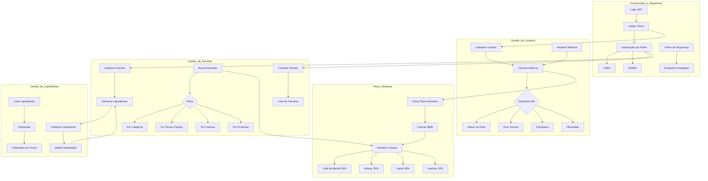

# ChefIT API 👨‍🍳

## Sobre o Projeto

O ChefIT é uma API RESTful inovadora que combina tecnologia e nutrição, oferecendo um sistema completo de gestão de receitas e planejamento alimentar personalizado. Desenvolvido para auxiliar tanto usuários individuais quanto profissionais da área de nutrição, o sistema calcula métricas individuais e recomenda receitas baseadas no perfil nutricional de cada usuário.

## 📊 Visão Geral do Sistema



## 🚀 Funcionalidades Principais

### 🔐 Sistema de Autenticação e Autorização
- **Autenticação JWT** com tokens seguros
- **Sistema de Roles** (USER e ADMIN)
- **Autorização granular** por endpoints
- **Validação de tokens** em tempo real
- **Filtros de segurança** customizados
- **Login flexível** por email ou telefone

### 👤 Gestão de Usuários
- Cadastro de perfil com dados antropométricos
- Cálculo automático de IMC e taxa metabólica basal (BMR)
- Acompanhamento e atualização de métricas
- Classificação do estado nutricional
- **Controle de acesso** - usuários só acessam seus próprios dados

### 📋 Planos Alimentares
- Geração de planos alimentares personalizados
- Distribuição calórica inteligente entre refeições:
  - Café da manhã (25% das calorias diárias)
  - Almoço (35% das calorias diárias)
  - Jantar (30% das calorias diárias)
  - Lanches (10% das calorias diárias)
- Recomendações baseadas em objetivos pessoais
- **Acesso protegido** - apenas usuários autenticados

### 🍳 Gestão de Receitas
- Cadastro detalhado de receitas com:
  - Informações nutricionais por porção
  - Lista de ingredientes e quantidades
  - Modo de preparo
  - Tempo de preparação
  - Categorização
- Sistema de busca avançada com filtros por:
  - Categoria
  - Tempo de preparo
  - Calorias
  - Proteínas
- Sistema de receitas favoritas **personalizado por usuário**
- **Permissões diferenciadas**: leitura pública, criação autenticada

### 🥕 Gestão de Ingredientes
- Cadastro de ingredientes com unidades de medida
- Listagem paginada e ordenada
- Validação de duplicidade
- Integração com receitas
- **Controle administrativo** - apenas ADMINs podem criar

## 🛠 Tecnologias Utilizadas

- **Spring Boot**: Framework para desenvolvimento da API
- **Spring Security**: Sistema de autenticação e autorização
- **JWT (JSON Web Tokens)**: Autenticação stateless
- **PostgreSQL**: Banco de dados relacional
- **JdbcTemplate**: Camada de acesso a dados
- **BCrypt**: Criptografia de senhas
- **Swagger/OpenAPI**: Documentação da API

## 🔐 Sistema de Segurança

### Arquitetura JWT
- **JwtService**: Geração e validação de tokens
- **CustomUserDetails**: Implementação personalizada do UserDetails
- **JwtAuthenticationFilter**: Filtro de autenticação por token
- **AuthorizationService**: Serviços de autorização e controle de acesso

### Roles e Permissões
```
USER:
- Acessar próprios dados
- Criar e gerenciar receitas
- Favoritar/desfavoritar receitas
- Visualizar ingredientes

ADMIN:
- Todas as permissões de USER
- Criar ingredientes
- Acessar dados de qualquer usuário
- Gerenciar sistema
```

### Endpoints Públicos vs Protegidos
```
Públicos:
- POST /auth/login
- POST /usuarios (cadastro)
- GET /receitas/{id}
- GET /receitas/busca
- GET /ingredientes

Protegidos:
- GET /auth/me
- GET /usuarios/{id}
- POST /receitas
- GET /receitas/favoritas/{usuarioId}
- POST /ingredientes (apenas ADMIN)
```

## 📝 Endpoints Principais

### Autenticação
```
POST /auth/login                   - Login com email/telefone
GET /auth/validate                 - Validar token JWT
GET /auth/me                       - Dados do usuário logado
```

### Usuários
```
POST /usuarios                     - Cadastrar novo usuário (público)
GET /usuarios/{id}                 - Buscar usuário por ID (próprio ou admin)
GET /usuarios/{id}/metricas        - Calcular métricas do usuário
PUT /usuarios/{id}/atualizar-metricas - Atualizar métricas
GET /usuarios/{id}/plano-alimentar - Gerar plano alimentar
```

### Receitas
```
POST /receitas                     - Cadastrar nova receita (autenticado)
GET /receitas/{id}                 - Buscar receita por ID (público)
GET /receitas/recomendadas/{usuarioId} - Buscar receitas recomendadas (autenticado)
GET /receitas/busca               - Buscar receitas com filtros (público)
POST /receitas/{id}/favoritar/{usuarioId} - Favoritar receita (próprio ou admin)
DELETE /receitas/{id}/desfavoritar/{usuarioId} - Desfavoritar receita (próprio ou admin)
GET /receitas/favoritas/{usuarioId} - Listar receitas favoritas (próprio ou admin)
```

### Ingredientes
```
POST /ingredientes                 - Cadastrar novo ingrediente (apenas ADMIN)
GET /ingredientes                  - Listar ingredientes (público)
GET /ingredientes/{id}             - Buscar ingrediente por ID (público)
```

## 🚀 Como Executar

1. **Pré-requisitos**
   - Java 17 ou superior
   - PostgreSQL 12 ou superior
   - Maven

2. **Configuração do Banco de Dados**
   ```sql
   CREATE DATABASE chefit;
   ```

3. **Configuração do application.properties**
   ```properties
   spring.datasource.url=jdbc:postgresql://localhost:5432/chefit
   spring.datasource.username=seu_usuario
   spring.datasource.password=sua_senha
   
   # Configurações JWT (opcional - usa padrões)
   jwt.secret=${JWT_SECRET:SuaChaveSecretaAqui}
   jwt.expiration=1800000
   ```

4. **Compilar e Executar**
   ```bash
   mvn clean install
   mvn spring-boot:run
   ```

5. **Acessar a Documentação**
   ```
   http://localhost:8080/swagger-ui.html
   ```

## 🔑 Como Usar a Autenticação

### 1. Fazer Login
```bash
curl -X POST http://localhost:8080/auth/login \
  -H "Content-Type: application/json" \
  -d '{
    "identificacao": "usuario@email.com",
    "senha": "123456"
  }'
```

### 2. Usar o Token
```bash
curl -X GET http://localhost:8080/auth/me \
  -H "Authorization: Bearer SEU_TOKEN_AQUI"
```

### 3. Resposta do Login
```json
{
  "token": "eyJhbGciOiJIUzI1NiIsInR5cCI6IkpXVCJ9...",
  "userId": 1,
  "nome": "João Silva",
  "email": "joao@email.com",
  "telefone": "11999999999",
  "tipoUsuario": "USER"
}
```

## 📊 Estrutura do Banco de Dados

### Tabelas Principais

- **usuarios**
  - Dados pessoais
  - Métricas antropométricas
  - **Senha criptografada (BCrypt)**
  - **Tipo de usuário (USER/ADMIN)**

- **receitas**
  - Informações da receita
  - Dados nutricionais
  - Instruções de preparo

- **ingredientes**
  - Cadastro de ingredientes
  - Unidades de medida

- **receitas_ingredientes**
  - Relacionamento entre receitas e ingredientes
  - Quantidades

- **receitas_favoritas**
  - Relacionamento entre usuários e receitas favoritas
  - **Controle de acesso por usuário**

## 🔐 Segurança e Validações

- **Autenticação JWT** stateless
- **Autorização baseada em roles**
- **Criptografia de senhas** com BCrypt
- **Validação de propriedade** de recursos
- **Filtros de segurança** em toda a aplicação
- **Tratamento seguro de erros**
- **Validação de dados de entrada**
- **Paginação para grandes conjuntos de dados**

## 📈 Métricas e Cálculos

### Cálculo de IMC
- Abaixo do peso: < 18.5
- Peso normal: 18.5 - 24.9
- Sobrepeso: 25 - 29.9
- Obesidade: ≥ 30

### Distribuição Calórica
- Baseada na taxa metabólica basal (BMR)
- Ajustada conforme objetivo do usuário
- Distribuída entre as refeições diárias

## 🤝 Contribuindo

1. Faça um fork do projeto
2. Crie uma branch para sua feature (`git checkout -b feature/AmazingFeature`)
3. Commit suas mudanças (`git commit -m 'Add some AmazingFeature'`)
4. Push para a branch (`git push origin feature/AmazingFeature`)
5. Abra um Pull Request

## 📝 Licença

Este projeto está sob a licença MIT. Veja o arquivo [LICENSE](LICENSE) para mais detalhes.

## ✨ Próximos Passos

- [x] **Implementação de autenticação JWT** ✅
- [x] **Sistema de autorização por roles** ✅
- [x] **Controle de acesso granular** ✅
- [ ] Refresh Tokens para melhor experiência do usuário
- [ ] Integração com serviço de imagens para receitas
- [ ] Sistema de avaliações e comentários
- [ ] Exportação de plano alimentar em PDF
- [ ] Integração com aplicativo móvel
- [ ] Sistema de notificações e lembretes
- [ ] Rate limiting para APIs
- [ ] Logs de auditoria

## 🛡️ Considerações de Segurança em Produção

- **Variáveis de ambiente** para chaves secretas
- **HTTPS obrigatório** em produção
- **Configuração de CORS** adequada
- **Monitoramento de tentativas de login**
- **Logs de segurança**
- **Backup e recovery** do banco de dados

## 📧 Contato

Para sugestões, dúvidas ou contribuições, entre em contato através das issues do projeto.

---
Desenvolvido com ❤️ para uma alimentação mais saudável e consciente.